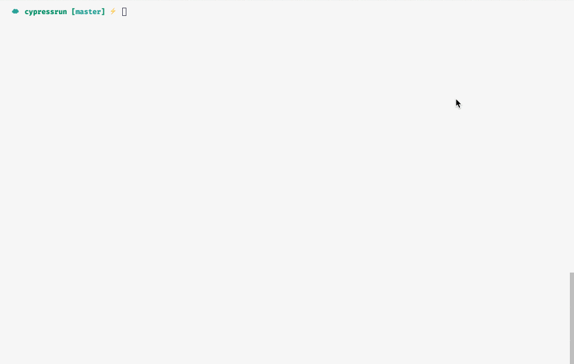

<p align="center">
 
</p>

<br />

[]()
[]()
[]()
[](https://github.com/prettier/prettier)
[](#contributors-)
[](https://github.com/ngneat/)

> Superhuman Cypress Run Command

`cypress run` that lets you select files or folders to run

## Usage

Select one spec file or folder:

```bash
npx cyrun
```



Select multiple specs file or folders:

```bash
npx cyrun -m
```

Forward the original command args:

```bash
npx cyrun --headed
```

Checkout the complete options list in the [official](https://docs.cypress.io/guides/guides/command-line.html#How-to-run-commands) docs.
